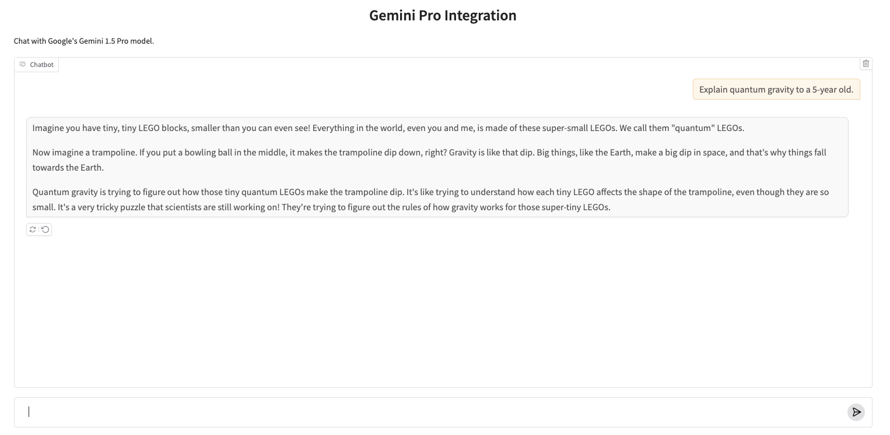

# `gemini-gradio`

is a Python package that makes it very easy for developers to create machine learning apps that are powered by Google's Gemini API.

# Installation

You can install gemini-gradio directly using pip:

```bash
pip install gemini-gradio
```

# Basic Usage

You'll need to set up your Gemini API key first:

```bash
export GEMINI_API_KEY=<your token>
```

Then in a Python file, write:

```python
import gradio as gr
import gemini_gradio

gr.load(
    name='gemini-1.5-pro-002',
    src=gemini_gradio.registry,
).launch()
```

Run the Python file, and you should see a Gradio Interface connected to the Gemini model!


# Voice Chat

You can enable voice chat with Gemini by setting the `enable_voice` parameter:

```python
import gradio as gr
import gemini_gradio

gr.load(
    name='gemini-1.5-pro-002',
    src=gemini_gradio.registry,
    enable_voice=True
).launch()
```

This will create a voice interface where you can have a spoken conversation with the Gemini model using your microphone.

## Required API Keys for Voice Chat

For voice chat functionality, you'll need:
1. `GEMINI_API_KEY` - Your Google Gemini API key
2. `GOOGLE_API_KEY` - Your Google API key (required for multimodal features)
3. Twilio credentials for WebRTC functionality:
   - `TWILIO_ACCOUNT_SID`
   - `TWILIO_AUTH_TOKEN`

Make sure these environment variables are set before using the voice chat feature.

# Customization 

Once you can create a Gradio UI from a Gemini endpoint, you can customize it by setting your own input and output components, or any other arguments to `gr.Interface`. For example, the screenshot below was generated with:

```py
import gradio as gr
import gemini_gradio

gr.load(
    name='gemini-2.0-flash-exp',
    src=gemini_gradio.registry,
    title='Gemini-Gradio Integration',
    description="Chat with Gemini Pro model.",
    examples=["Explain quantum gravity to a 5-year old.", "How many R are there in the word Strawberry?"]
).launch()
```


# Composition

Or use your loaded Interface within larger Gradio Web UIs, e.g.

```python
import gradio as gr
import gemini_gradio

with gr.Blocks() as demo:
    with gr.Tab("Gemini Pro"):
        gr.load('gemini-1.5-pro-002', src=gemini_gradio.registry)
    with gr.Tab("gemini-1.5-flash"):
        gr.load('gemini-1.5-flash', src=gemini_gradio.registry)

demo.launch()
```

# Under the Hood

The `gemini-gradio` Python library has two dependencies: `google-generativeai` and `gradio`. It defines a "registry" function `gemini_gradio.registry`, which takes in a model name and returns a Gradio app.

# Supported Models in Gemini

All chat API models supported by Google's Gemini are compatible with this integration. For a comprehensive list of available models and their specifications, please refer to the [Google AI Studio documentation](https://ai.google.dev/models/gemini).

-------

Note: if you are getting an authentication error, then the Gemini API Client is not able to get the API token from the environment variable. You can set it in your Python session like this:

```python
import os

os.environ["GEMINI_API_KEY"] = ...
```